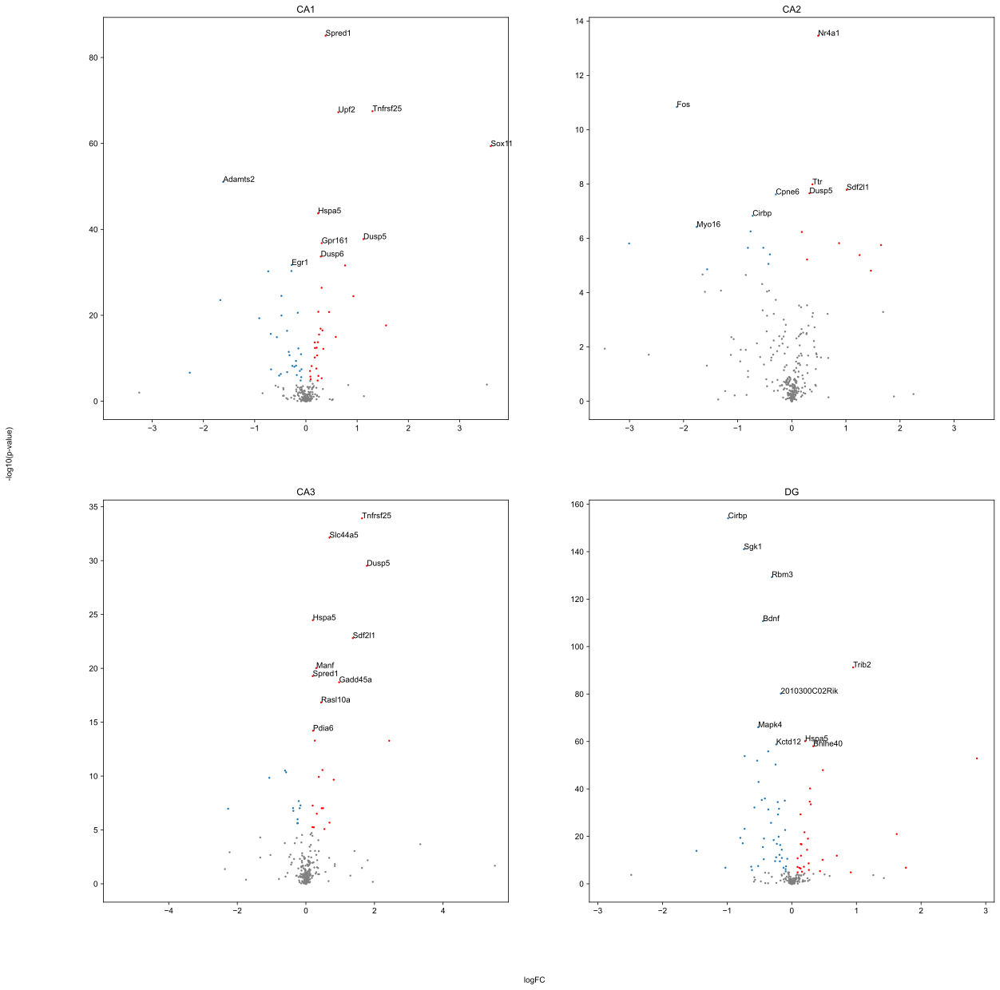

---
header-includes:
  - \usepackage{mathrsfs}
geometry: margin=1in
output: pdf_document
---

### Abbreviations assumed to be described already
SD/NSD
CA1, CA2, CA3
DG

### Clustering of and analysis of Xenium data

Data analysis was performed on Xenium samples from a total of 6 male mice (3 NSD, 3 SD), using the stock gene panel from 10x Genomics containing a total of 297 genes, which we represent as $N_g$. The data for each sample was restricted to include only cells contained within the hippocampal formation, as seen in **Fig. X**, giving a unique number of cells for each sample, identified as $N_c$. The gene expression matrix for each mouse, with a size of $N_g \times N_c$, was then log2 normalized. Cosine distance was calculated for each cell within the hippocampal formation of a single sample by taking 1 minus the dot product of a vector of the transcriptomic data for each cell divided by the product of the norms of each vector as in Eq. 1.

$$
S_c(c_i,c_j) = 1 - \frac{c_i \cdot c_j}{\|c_i\|\|c_j\|}
$$

Where $c_i$ and $c_j$ are individual cells within the dataset. This calculation gave us a distance metric $S_c$ where 0 means two cells are identical in expression, while 1 means cells display inverse expression patterns. 

Spectral clustering was performed on each sample by first collecting each of these distances $S_c$ into an $N_c \times N_c$ matrix called $W$ for each sample that was then min-max normalized. The matrix $W$ was used as the adjacency matrix to calculate the graph Laplacian. The sum of all columns in $W$ was next used to create a diagonal matrix $D$.The graph Laplacian was calculated for each sample by subtracting $W$ from $D$, giving the matrix $L$. For each sample, 250 eigenvectors and eigenvalues were calculated for $L$ and the sorted eigenvectors were used as input for a k-means clustering with $k=15$ on each sample. 

Following the clustering, samples were labeled using clusters based on either anatomical regions or cell type association. Each clustering for the individual samples was first visually inspected for anatomical alignment with the following hippocampal subregions: CA1, CA2, CA3, and DG. Additionally, each of the samples showed an additional cluster in the DG related to DG interneurons that was labeled as one of the cell type clusters. During the labeling of clusters, if two clusters showed the same region these were combined together into a single cluster. In the end, a total of 11 clusters were analyzed representing 4 regions, 6 cell types, and 1 cluster for the remaining unlabeled cells.

### Cell type identification

In order to identify whether clusters were associated with a particular cell type, an analysis was performed to identify the predominant cell type in each of the remaining clusters that were not assigned to a hippocampal region. The cell types used in this analysis were: astrocytes, entothelial cells, microglia, oligodendrocytes, and neurons. In order to identify cell types, a z-scored gene matrix was first calculated for each hippocampal sample. Using the genes in **Table X**, the mean z-score of the genes in each group is calculated and plotted as seen in **Fig. X**. 

 and each of the 15 clusters was assigned an anatomically based cluster name for one of the following regions: CA1, CA2, CA3, dentate gyrus (DG), DG/CA4, or nonspecific cells. 
 
 ### Differentially expressed gene analysis

 Using these labels we then ran a t-test for all cells within the each of the regions or cell types separately, looking for changes in gene expression across all cells in a particular cluster. Sidak correction was used to account for multiple comparisons, where an alpha of $p=0.05$ was adjusted based on the number of t-tests performed, i.e. the number of genes (Eq. 2). A gene was considered to be significantly differentially expressed if the p-value for the t-statistic was below the calculated $\alpha_s = 1.57 \times 10^{-5}$.

$$
\alpha_s = 1 - (1-\alpha)^{1/N_g}
$$

### Figure description

Figure X: Clustering, UMAP, and t-statistics of Xenium data. A Shows the clustering of a single Xenium sample within the hippocampal formation, labeled for regions of particular interest. B Is the UMAP plot of all cells from all samples used in the analysis, labeled with the regions of interest. C Displays the t-statistic for the gene Rbm3 in the CA1 and CA3 regions of the hippocampus, with a significant decrease in expression in the CA1 ($p < 5.62e^{-5}$). D Displays the t-statistic for Gpr161 in the CA1 and CA3 regions of the hippocampus, with a significant increase in expression in the CA3 ($p < 3.15e^{-24}$)
